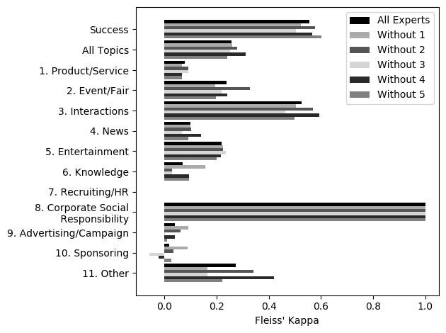
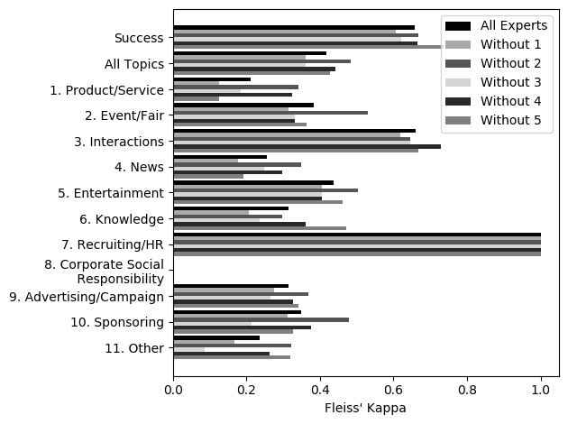

# Corpus on German topic classification and success (GTCS6k)
## A German Corpus on Topic Classification and Success of Social Media Posts from Facebook
On this page we provide the data set for the corpus on German topic classification and success (GTCS6k), which was first presented on CONFERENCE_NAME along with a full paper. Details can be found in the section [Citation](#citation) below.

## Description
The corpus consists of 6,000 annotated Facebook posts from the food delivery services sector in Germany. The posts belong to six of the industry's most important brands and are in German. Among the brand pages are <a href="https://www.facebook.com/callapizza/">Call a Pizza</a>, <a href="https://www.facebook.com/DeliverooDE/">Deliveroo</a>, <a href="https://www.facebook.com/dominosdeutschland/">Domino's</a>, <a href="https://www.facebook.com/lieferando/">Lieferando</a>, <a href="https://www.facebook.com/Mundfein/">Mundfein</a> and <a href="https://www.facebook.com/SmileysPizza/">Smiley's</a>. The annotation was conducted by the agency <a href="https://www.althallercommunication.de/">ALTHALLER communication GbR</a>, which advises companies in corporate communications. Five experts of the agency, who regularly produce social media posts on behalf of the clients, took over the work of the annotation over a period of 2 months (May to June 2019). The experts annotated each post according to topic and success.
<!--To annotate the topic, they created a list of 11 thematic categories of corporate communication. Each post was assigned one or more of these thematic categories that best describe its content. Success, on the other hand, was classified either as *successful* or *not successful*.
-->
### Classes to annotate
During the annotation, the experts evaluated two aspects of a post, its success and the topic. Success depends on the perception of the post by the users and can be rated as *successful* or *not successful*. The topic, on the other hand, describes the content of the post. Since it can have several topics at the same time, one or more topics can be chosen that best describe the content of the post. The following eleven thematic classes, developed by the experts, were available for selection:
  1. Product/Service: Product launch, preview, review
  2. Event/Fair
  3. Interactions: Contest, survey, question
  4. News: News from the environment
  5. Entertainment: Memes, jokes, virals, contests
  6. Knowledge: Tip, expertise, insight, case study, FAQ, research
  7. Recruiting/HR: Employee feature, interview, testimonial, job advertisement
  8. Corporate social responsibility (CSR)
  9. Advertising/Campaign: Testimonial, discounts, lead generation
  10. Sponsoring
  11. Other: None of the above categories

## Statistics
In order to achieve a high quality of annotation, two training phases were carried out, whereby the experts evaluated 50 posts in each phase. After each phase, an inter-rater reliability was conducted with [Fleiss' Kappa](https://en.wikipedia.org/wiki/Fleiss%27_kappa) to measure the quality of the annotation. The resulting kappa values are shown in figure 1. The values of the first phase are shown on the left, those of the second on the right. In order to determine the impact of each expert on the kappa value, further kappa values were calculated for all combinations of n-1 experts.

<div>
<figure>

<figcaption align="center">Fig.1 - Annotator Agreement</figcaption>
</figure>
</div>

After completion of the training phases, a further 6,000 posts were annotated, which form the core of the corpus. Their quality can be considered assured due to the solid inter-rater reliability of the training phases. Table 1 shows the quota of the 6,000 posts assigned to each of the thematic categories. The distribution of the second criterion success is shown in table 2.

<figure>
<figcaption>Tab.1 - Number of posts per class in 6,000 posts (multi-label)</figcaption>
<table>
  <thead>
    <tr>
      <th></th>
      <th align="right">Posts</th>
      <th align="right">Percent</th>
    </tr>
  </thead>
  <tbody>
    <tr>
      <td align="left">1. Product/Service</td>
      <td align="right">316</td>
      <td align="right">5.22 %</td>
    </tr>
    <tr>
      <td align="left">2. Event/Fair</td>
      <td align="right">368</td>
      <td align="right">6.07 %</td>
    </tr>
    <tr>
      <td align="left">3. Interactions</td>
      <td align="right">2370</td>
      <td align="right">39.12 %</td>
    </tr>
    <tr>
      <td align="left">4. News</td>
      <td align="right">547</td>
      <td align="right">9.03 %</td>
    </tr>
    <tr>
      <td align="left">5. Entertainment</td>
      <td align="right">978</td>
      <td align="right">16.14 %</td>
    </tr>
    <tr>
      <td align="left">6. Knowledge</td>
      <td align="right">390</td>
      <td align="right">6.44 %</td>
    </tr>
    <tr>
      <td align="left">7. Recruiting/HR</td>
      <td align="right">65</td>
      <td align="right">1.07 %</td>
    </tr>
    <tr>
      <td align="left">8. Corporate Social Responsibility (CSR)</td>
      <td align="right">40</td>
      <td align="right">0.66 %</td>
    </tr>
    <tr>
      <td align="left">9. Advertising/Campaign</td>
      <td align="right">4098</td>
      <td align="right">67.63 %</td>
    </tr>
    <tr>
      <td align="left">10. Sponsoring</td>
      <td align="right">322</td>
      <td align="right">5.31 %</td>
    </tr>
    <tr>
      <td align="left">11. Other</td>
      <td align="right">541</td>
      <td align="right">8.93 %</td>
    </tr>
  </tbody>
</table>
</figure>

<figure>
<figcaption>Tab.2 - Number of posts by success in 6,000 posts</figcaption>
<table style="margin: 0px auto;">
  <tr>
    <th></th>
    <th align="left">Posts</th>
    <th align="left">Percent</th>
  </tr>
  <tr>
    <td align="left">Not successful</td>
    <td align="right">4578</td>
    <td align="right">76.3 %</td>
  </tr>
  <tr>
    <td align="left">Successful</td>
    <td align="right">1422</td>
    <td align="right">23.7 %</td>
  </tr>
</table>
</figure>

## License
The corpus is provided under the terms of the [Creative Commons Attribution-NonCommercial-ShareAlike 4.0 International (CC BY-NC-SA 4.0) License](http://creativecommons.org/licenses/by-nc-sa/4.0/). By using the corpus you agree to this license.


## Citation
The corpus was first presented at [FRUCT' 25](https://fruct.org/conference25).
> *Max-Emanuel Keller, Johannes Forster, Peter Mandl, Frederic Aich, Jacqueline Althaller<br>
> **A German Corpus on Topic Classification and Success of Social Media Posts**<br>
> Proceedings of the 25th Conference of Open Innovations Association FRUCT<br>
> Helsinki, Finland, November 2019<br>*

If you are using the corpus, please cite the following publication. You can find a copy of the [paper here](https://fruct.org/publications/abstract25/files/Kel.pdf). Reference in BibTeX format:
 ```
@inproceedings{Keller.2019,
 author = {Keller, Max-Emanuel and Forster, Johannes and Mandl, Peter and Aich, Frederic and Althaller, Jacqueline},
 title = {A German Corpus on Topic Classification and Success of Social Media Posts},
 booktitle = {Proceedings of the 25th Conference of Open Innovations Association FRUCT},
 series = {FRUCT'25},
 year = {2019},
 location = {Helsinki, Finland},
 publisher = {FRUCT Oy},
 address = {Helsinki, Finland},
}
 ```

## How to use the data set?
The [repository to this page](https://github.com/ccwi/corpus-gtcs6k) provides the data set to the corpus along with the experiments and instructions for use.

## About
The presented corpus was developed during a joint project between the <a href="https://www.wirtschaftsinformatik-muenchen.de/">Competence Center Wirtschaftsinformatik (CCWI)</a> at the Munich University of Applied Sciences and the agency <a href="https://www.althallercommunication.de/">ALTHALLER communication GbR</a>.

<a href="https://www.wirtschaftsinformatik-muenchen.de/"></a>    <a href="https://www.althallercommunication.de/"></a>

## Acknowledgement
Our special thanks goes to all the experts of *ALTHALLER communication GbR* who contributed to the annotation of the corpus. The presented work was conducted as part of a project funded by *Forschungs- und Entwicklungsprogramm Informations- und Kommunikationstechnik des Freistaates Bayern*. Funding reference number: IUK482/002.

The methodology of this work was inspired by the great work of [Schabus et. al.](http://dx.doi.org/10.1145/3077136.3080711) wo created the [One Million Posts Corpus](https://ofai.github.io/million-post-corpus/) together with the Austrian newspaper *Der Standard* from user comments under online articles on the site of the newspaper.

<!--
## How to run the experiments?
-->
